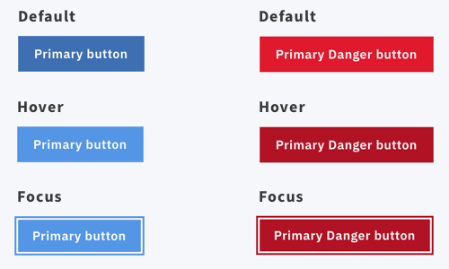

# Accessibility/A11y
## Learning/Reference Resources
- [WCAG](https://www.w3.org/TR/WCAG21/)
- [WebAIM](https://webaim.org/)
- [A11ycasts by Google Chrome Developers](https://www.youtube.com/watch?v=HtTyRajRuyY&list=PLNYkxOF6rcICWx0C9LVWWVqvHlYJyqw7g&index=29)
- [Google Web Accessibility on Udacity](https://www.udacity.com/course/web-accessibility--ud891)
- [A11y Project](https://a11yproject.com/)
- [eBay’s MIND Patterns](https://ebay.gitbooks.io/mindpatterns/)

## Discovery/Testing/Audits
- VoiceOver (Mac only, activate with `⌘F5`)
- [NVDA](https://www.nvaccess.org/) (cross-platform)
- Contrast ratio checkers
  - [http://accessible-colors.com/](http://accessible-colors.com/)
  - [http://jxnblk.com/colorable/demos/text/](http://jxnblk.com/colorable/demos/text/) (helpful for quickly finding a passing alternative by only adjusting the lightness value)
  - [Color Oracle](http://colororacle.org/) (also includes tests for color blindness)
  - [Contrast Analyser](https://developer.paciellogroup.com/resources/contrastanalyser/)
- Chrome Accessibility Audit
- [Tota11y](http://khan.github.io/tota11y/) by Khan Academy
- [WAVE Evaluation Tool](https://chrome.google.com/webstore/detail/wave-evaluation-tool/jbbplnpkjmmeebjpijfedlgcdilocofh)

## Process

### Document Outline

When beginning the UXD process for any new page or component, always start with a plain HTML outline to carefully plan a clean, semantic structure.

This process is helpful for taking advantage of semantic HTML5 elements wherever possible, and also providing an intuitive/valid hierarchy for headings and content. Additionally, this exercise reveals where additional information not provided in the visual design will be required to add context for users who rely on screenreaders, thereby providing helpful hidden text that otherwise might be overlooked.

For further learning, reference [HTML: A good basis for accessibility](https://developer.mozilla.org/en-US/docs/Learn/Accessibility/HTML) for guidance as you draft HTML markup.

### Color Contrast

When receiving any new design, review all combinations of foreground/background colors that involve text and/or interactive icons to ensure they meet WCAG 2.0 minimum color contrast requirements.

If a color combination fails to meet standards, communicate this issue to the design team, and optionally recommend a close alternative that passes the standard by only adjusting the lightness value of the color.

Recommended color contrast checkers:
- Contrast ratio checkers
  - [http://accessible-colors.com/](http://accessible-colors.com/)
  - [http://jxnblk.com/colorable/demos/text/](http://jxnblk.com/colorable/demos/text/) (helpful for quickly finding a passing alternative by only adjusting the lightness value)
  - [Color Oracle](http://colororacle.org/) (also includes tests for color blindness)
  - [Contrast Analyser](https://developer.paciellogroup.com/resources/contrastanalyser/)

### Color Blindness

In addition to ensuring colors have sufficient contrast between fore/background elements, it is also important to consider the various types of color blindness users may experience when evaluating color values and combinations.

### Review/Audit

As part of the QA process for UXD work, ensure the page/component is accessible with automated audits and manual testing.

As a first pass, use keyboard navigation and screenreader software to ensure all content is navigable, functional, and understandable for non-sighted users. Use [Vox’s Accessibility Checklist](http://accessibility.voxmedia.com) (particularly [the Engineer section](http://accessibility.voxmedia.com/#engineers)) as a guide for review.

As a second pass, take advantage of Chrome’s Accessibility Audit, which can be accessed within Inspector Tools’ Audits tab, to find any issues/areas of opportunity.

## Common Patterns

### Hidden Text

Visual presentations often communicate more information and context than what is provided by text alone, or act as a summary of complex information for quick understanding. Graphs, status indicators, and color codes/categories are common examples of this. Additionally, distinct content sections or even the page itself may not have an associated visible heading.

#### No `<h1–6>` is visually present

- Ensure each page has a relevant, unique `<h1>` that matches the URL path/SEO title.
- If a distinct content section only shows paragraph, list, etc. information, make sure a hidden heading of an appropriate level is provided as a landmark for screenreaders.

#### The visual presentation is inherently communicative/contextual

If any purely-visual element of a UI design is intended to disclose information to the user, ensure a hidden text alternative is provided for screenreaders.

- Ex: An agenda shows a timeline of scheduled event markers of various widths and colors to demonstrate the number, duration, and category of events occurring throughout the month.
  - A hidden text heading/summary of the agenda should be provided before the detailed list of event information. For example,
  > “Overview of April, 2018.
  > 32 events from April 2 to April 23 from 5 categories.”
  - Following the summary, each visual event indicator should contain hidden detail text, including the event category, title, duration, etc. For example,
  > “Conference event on April 15, 2018 from 9:00 a.m. to 4 p.m.
Please arrive early and check in at the registration table.”

### Images and Icons

- Decorative images don’t add context or information to a page, and are used solely for layout or visual interest. Decorative images should have an empty alt attribute `alt=“”`. Leaving the alt attribute empty means screenreaders will skip over the image.
- An effective alt attribute focuses on the function and purpose of the image, rather than a description of the image. It is concise. It avoids phrases such as “picture of,” “graphic of,” etc. For more info, [reference WebAIM’s guidelines](https://webaim.org/techniques/alttext/).
The alt attribute of a logo doesn’t need to include the word “logo.” A common practice is to set the alt attribute of a logo to the company’s name.
- To make your SVGs accessible, use a `<title>` and if needed a `<desc>` element. `<title>` should be the first child of their parent container and are used to give a title or brief description of the SVG’s content. To provide more details about an SVG, use the `<desc>` element immediately after the `<title>`. For further

### Button/Link Icons

A common UI pattern is to use icon-only interactive buttons/links to make the visual presentation easier to scan and save space. While it might be tempting to use `aria-label` attributes on buttons on anchor tags that only contain an icon, it is best to provide hidden text within the button/anchor tag to ensure the markup is valid:

```hbs
<button>
  <span class=”t-hidden”>Close</span>
  <svg>
    …
  </svg>
</button>
```

or

```hbs
<a href="…">
  <span class=”t-hidden”>Close</span>
  <svg>
    …
  </svg>
</a>
```

Both `<button>` and `<a>` are phrasing content, which should contain text to be considered valid. For more information, [reference MDN’s Content Categories](https://developer.mozilla.org/en-US/docs/Web/Guide/HTML/Content_categories).

### Focus States

All interactive elements should have a visible focus state to assist users who rely on keyboard navigation. Ideally, focus states are styled to ensure the focus “ring”/outline meets minimum color contrast requirements to aid users in wayfinding.

Because the default focus ring isn’t very visually appealing, a common pattern for buttons and link buttons is simply match the hover and focus state styles:

```css
.button {
  …
  &:hover,
  &:focus {
    …
  }
}
```
However, when evaluating this during keyboard navigation testing, the hover styles are often too subtle for users to easily locate their current location on the screen. For this reason, it is best to still provide dedicated styles for focus states that look great, have nice transitions, and help users find their place.



Shown above is IBM Carbon’s default, hover, and focus button styles. [View the full button design system](http://carbondesignsystem.com/components/button/code) and use keyboard navigation to view the focus state styles and animations.

### Custom form elements

Custom form elements often include multiple inputs and buttons that appear as a single input and have a single visual label. For accessibility, each input should have an associated label that can be hidden, and the visual “label” can instead be a heading to help group the inputs as a distinct section.

```hbs
<fieldset class="form-field-group">
  <h3 class=”form-label”>Start and end time</h3>
  <div class="form-field-duo">
    <div class="form-field-duo__half">
      <label class="t-hidden" for="startTime">Start time</label>
      <input name="startTime" id="startTime" type="time">
    </div>
    <div class="form-field-duo__half">
      <label class="t-hidden" for="endTime">End time</label>
      <input name="endTime" id="endTime" type="time">
    </div>
  </div>
</fieldset>
```

#### Custom checkbox/radio inputs

Custom checkboxes and radio inputs have many states that must be styled appropriately:
- Unchecked
  - Default
  - Hover
  - Focus
  - Disabled
- Checked
  - Default
  - Hover
  - Focus
  - Disabled

This is made particularly challenging due to the approach often used for custom checkbox/radio inputs, which relies on visually hiding the native input and instead using pseudo elements on the associated label to represent the input:

```hbs
<fieldset class="form-field-group">
  <h3 class="form-label">Options</h3>
  <div class="form-checkbox">
    <input
      class="form-checkbox__input"
      type="checkbox"
      name="option1"
      id="option1">
    <label class="form-checkbox__label" for="option1">Option 1</label>
  </div>
  <div class="form-checkbox">
    <input
      class="form-checkbox__input"
      type="checkbox"
      name="option2"
      id="option2">
    <label class="t-form-input form-checkbox__label" for="option2">Option 2</label>
  </div>
  <div class="form-checkbox">
    <input
      class="form-checkbox__input"
      type="checkbox"
      name="option3"
      id="option3">
    <label class="t-form-input form-checkbox__label" for="option3">Option 3</label>
  </div>
</fieldset>
```

As a result, we have to be clever in our pseudo selectors on the input to visually reflect the current state with the label:

```css
.form-checkbox {
  …
  &:not(.is-disabled),
  &:not(.form-checkbox--disabled) {
    …
    &:hover {
      .form-checkbox__input {
        &:not(:disabled) {
          &:not(:checked) + .form-checkbox__label:before {
            /* Unchecked hover styles go here */
          }
          &:checked + .form-checkbox__label:before {
            /* Checked hover styles go here */
          }
        }
      }
    }
  }
  &.is-disabled,
  &.form-checkbox--disabled {
    /* Disabled styles go here */
  }
}

.form-checkbox__input {
  /* Visually hide native input */
  &:not(:focus):not(:disabled) {
    &:not(:checked) + .form-checkbox__label:before {
      /* Unchecked default styles go here */
    }
    &:checked + .form-checkbox__label:before {
      /* Checked default styles go here */
    }
  }
  &:not(:checked):focus + .form-checkbox__label:before {
    /* Unchecked focus styles go here */
  }
  &:checked:focus + .form-checkbox__label:before {
    /* Check focus styles go here */
  }
  &:disabled {
    /* Disabled styles go here */
    & + .form-checkbox__label {
      /* Disabled styles go here */
      &:before {
        /* Unchecked disabled styles go here */
      }
    }
    &:checked + .form-checkbox__label:before {
      /* Checked disabled styles go here */
    }
  }
}
```

### Modals/Dialogs

#### Announcing

When a modal/dialog opens, screenreader focus should be brought to the first focusable child of the dialog (which is typically the close button in a message dialog). At this point, the screenreader should announce the dialog title and any following content.

#### Focus Cycling/Trapping

Dialog markup should be a direct descendant of the `<body>` element, and a sibling of the main content wrapper. By default, the “closed” dialog should have `role=”dialog”` and either/both a `hidden` attribute (if appropriate browser support exists) or `display: none;` to ensure it is not focusable until it is open.

When a user interacts with a button that opens a dialog, focus should move from the triggering button to the first focusable child of the dialog. If there are multiple focusable children, focus should proceed through the elements until focus arrives at the dialog close button. If the user continues to `Tab`, focus may proceed to the browser URL bar, but then should cycle back to the first focusable child of the dialog, repeating the cycle.

Focus should be trapped within the dialog when it is open. This is guaranteed by making the sibling main content element “inert”, typically with `aria-hidden=”true”`.

If the user interacts with the dialog close button, the main content element should be reset to `aria-hidden=”false”`, the dialog markup should be hidden, and focus should return to the button that originally opened the dialog.

For further reference and example patterns, check out [eBay’s MIND Patterns](https://ebay.gitbooks.io/mindpatterns/content/disclosure/dialog.html) for dialogs and [A11ycasts’ episode on dialogs](https://www.youtube.com/watch?v=JS68faEUduk).

### Alert Banners

Alert banners should have their role attribute set to `alertbanner`. They also should have either: `aria-labelledby` that references the element containing the title of the banner if it has a visible title or an `aria-label` attribute if there is not a visible title. In addition, the element needs an `aria-describedby` attribute that references the content of the alert banner.

Screenreader focus is given to the actionable item within the banner (typically a button) and the title and message of the alert is read.

```hbs
<div class="banner banner--success" role="alertdialog" aria-label="Success notification" aria-describedby="bannerMessage">
  <div class="banner__details">
    <div class="banner__details__copy">
      {{svg-jar "icons/icon-banner-success" class="banner__details__icon banner__details__icon--success"}}
      <p class="t-body banner__details__message" id="bannerMessage">Calendar successfully published.</p>
    </div>
  </div>
  <button class="button-text button-text--setback banner__button-setback">
    {{svg-jar "icons/icon-close" class="button-text__icon"}}
    <span class="button-text__text">Dismiss</span>
  </button>
</div>
```

#### Dismissal

Alerts should not automatically disappear without receiving user input. This guarantees users have enough time to read and understand the alert message, and intend for the alert to be dismissed and resume their activity. It is best to provide a dedicated dismissal button that receives screenreader focus upon the alert becoming active.

For more information, reference [WAI-ARIA’s guidelines](https://www.w3.org/TR/wai-aria-practices-1.1/#alertdialog) and [A11ycast’s episode on alerts](https://www.youtube.com/watch?v=5lzAj1ahRSI).

## ARIA

- Most ARIA roles are implicit in semantic HTML5 elements. Reference [the document conformance table from the W3C](https://www.w3.org/TR/html-aria/#docconformance) to see if an element needs an explicit ARIA role. If you set an explicit ARIA role, note that each element should only have one role and that you should not set a role that overrides the semantics of an element.
- `aria-hidden` is an attribute that accepts a boolean that tells screenreaders if they should ignore or show content. If you’re toggling visibility of content, don’t forget to also toggle `aria-hidden`’s boolean. For more information, [view the W3C’s documentation of aria-hidden](https://www.w3.org/TR/wai-aria-1.1/#aria-hidden).
- Similar to `aria-hidden`, `aria-disabled` is an attribute that accepts a boolean that tells screenreaders that the element it’s applied to (and its children) are visible but inoperable. [view the W3C’s documentation of aria-disabled](https://www.w3.org/TR/wai-aria-1.1/#aria-disabled).
- `aria-label` and `aria-labelledby` are similar attributes in that they both associate a label to another element. If the label text is visible, use `aria-labelledby`. Otherwise, use `aria-label`. view the W3C’s documentation of [aria-label](https://www.w3.org/TR/wai-aria-1.1/#aria-label) and [aria-labelledby](https://www.w3.org/TR/wai-aria-1.1/#aria-labelledby).
- For more information, reference Google's Intro to ARIA or MDN’s AIRA basics.
