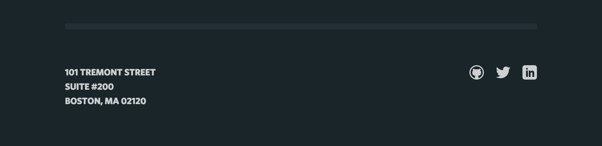

# Class Naming Conventions

## Avoid IDs for Style Hooks

Don’t use IDs to style elements. Everything that needs styles can be done without IDs. Avoid usage because of their heightened specificity. For more, refer to [CSS Wizardry’s “Pain in the class” blog post](http://csswizardry.com/2011/09/when-using-ids-can-be-a-pain-in-the-class/).

We should still use IDs for [fragment identifiers](http://csswizardry.com/2011/06/namespacing-fragment-identifiers/#fragment-identifiers) as needed.

Rarely, you may be required to style markup that you can't edit where an ID is the _only_ useful selector available (embedded HTML generated by a 3rd party, for example). In this case, use an attribute selector to target that ID without increasing specificity:

```css
/* Targets the exact ID in the 3rd-party content */
.third-party-markup [id='embed-element'] {}

/* targets any ID that contains `embed-` in the 3rd-party content */
.third-party-markup [id*='embed-'] {}
```

For more on attribute selectors, read this [CSS-Tricks post](https://css-tricks.com/attribute-selectors/).

## BEM Naming Conventions

Use `.block__element--modifier` syntax for naming classes. Refer to [CSS Wizardry’s MindBEMding blog post](http://csswizardry.com/2013/01/mindbemding-getting-your-head-round-bem-syntax/) and the [BEM website](https://bem.info/method/definitions/).

### Blocks

A **block** is a distinct component. Its name can contain single-hyphens ('-') for compound words. The following are all valid blocks:

```css
.card {}
.twitter-embed {}
.nav-item {}
.first-world-problem {}
```

### Elements

An **element** is a child element inside the block. It's written with a double-underscore between the block and the element: `block__element`. Here are some examples of valid element selectors:

```css
.card__title {}
.twitter-embed__username {}
.nav-item__link {}
```

You may occasionally need a grandchild element, but not frequently. Great-grandchildren should be treated as a "[code smell](https://en.wikipedia.org/wiki/Code_smell)" that triggers a refactor.

```css
/* Maybe refactor */
.nav-item__link__icon {}
/* Almost always refactor */
.card__title__author__role {}
```

### Modifiers

A **modifier** is a style variation for an element. Attach a modifier to the end of a block or element with a double-hyphen (`block--modifier`, `block__element--modifier`).

```css
.card--shadow {}
.twitter-embed--featured {}
.nav-item__link--inverted {}
```

While you might occasionally chain BEM elements to create grandchildren, [avoid chaining modifiers](http://reefpoints.dockyard.com/2015/01/05/avoid-chaining-modifiers.html). Here are some examples of multiple modifier solutions:

```css
/* Avoid */
 .card--shaded--large {}

/* Separate classes for each modifier is good. */
.card--shaded {}
.card--large {}

/* Using a functional (not visual) modifier is also good. */
.card--prominent {}
```

```css
/* That's OK. */
.card--prominent__title--highlighted {}

/* This is good too, but be aware of the increased specificity. */
.card--prominent .card__title--highlighted {}
```

## SMACSS Conventions

BEM is our primary class naming pattern, but we also borrow some SMACSS techniques.

### State Classes

The [modifier classes described above](#modifiers) are for style variations that are part of a component's normal state. For style changes that change while the user interacts with the site, [SMACSS's `.is-*` and `.has-*` classes](https://smacss.com/book/type-state) are recommended.

#### `.is-*`

An `.is-*` state class communicates a change on the element itself, for example: `.nav__link.is-active` when a nav link is highlighted to show that it is the current page.

#### `.has-*`

A `.has-*` state class communicates a change having to do with an element's children for example: `.field-group.has-error` when a `fieldset` has an `input` with an invalid value.

#### Scoping States

An state class should not typically be styled globally: a modal with `.is-open` requires different styles from an accordion section with `.is-open`; a form with `.has-error` needs different styles from a baseball player's stat-sheet with `.has-error`.

```scss
.nav__link {
  border-bottom: 3px solid transparent;
  &.is-active {
    border-bottom-color: currentColor;
  }
}
.field-group {
  &.has-error {
    outline: 2px solid red;
  }
}
```

### Layout Classes

Use `.l-*` for layout styles - borrowed from [SMACSS layout rules](https://smacss.com/book/type-layout). These styles include the `.l-*` element's layout and positioning as well as grid layout styles that afffect child positioning. Typical CSS to use in layout classes includes Flexbox, Grid, wraps, floats, columns, overflows, and positioning.

```css
.l-card-grid {
  margin: 40px auto;
  padding: 0 10px;
  display: grid;
  grid-template-columns: repeat(2, 1fr);
  grid-gap: 10px;

  @media (min-width: 600px) {
    grid-template-columns: repeat(3, 1fr);
  }
}
/* Add BEM modifiers if needed */
.l-card-grid--small-cards {
  grid-template-columns: repeat(4, 1fr);
  grid-gap: 5px;

  @media (min-width: 600px) {
    grid-template-columns: repeat(8, 1fr);
  }
}
```

### Typography Classes

Use `.t-*` for reusable type styles. Typical CSS to use here includes font-related properties, color, letter-spacing, text-transform, etc. Here are some examples:

```css
/* Headline styles */
.t-headline {}
/* Body styles */
.t-body {}
```

Avoid putting padding and margin into `.t-*` classes. It's common to modify those properties based on component context; we'd prefer to avoid mixing selectors for those modifications:

```scss
/* Avoid this */
.t-headline {
  margin-bottom: 16px;

  .blog-post & {
    margin-bottom: 12px;
  }
}
```


## Common Patterns
### "Parent" Selectors

  [Here is a JS bin to illustrate this pattern.](http://jsbin.com/jekugoj/edit?html,css,output)

  

  Here is a footer with social links. The group of social links would be
  called `.socials`, each item is a `.social` and if you need specific
  style on the Twitter icon, it would be called `.social--twitter`.

  We would rather use its singular form (`.social`) than call each item
  `.socials__social`. This is sometimes referred to as the [Plural Parent
  Pattern](http://codepen.io/jlong/pen/IzpEJ/).
